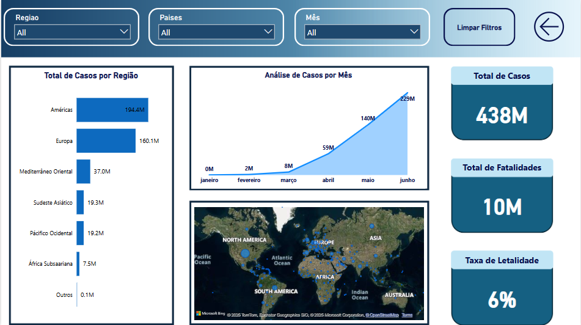
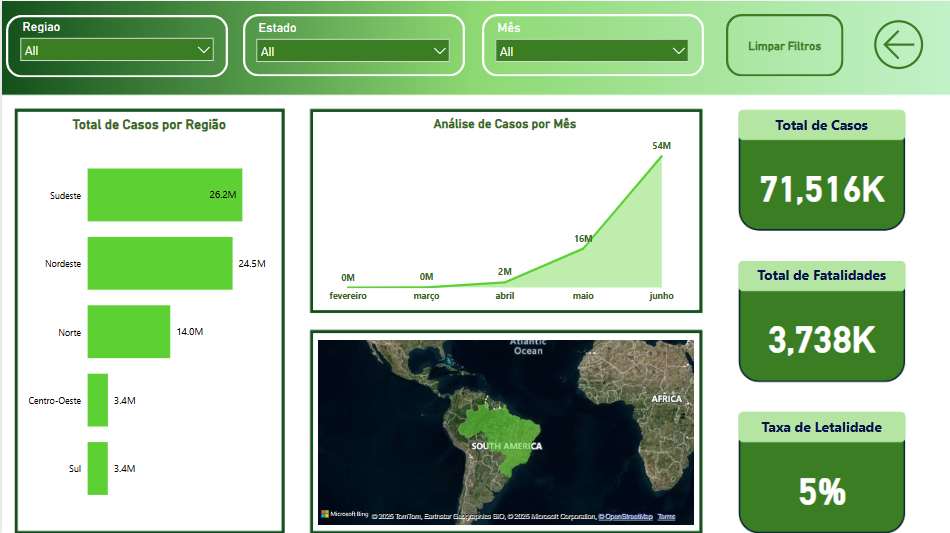

# Dashboard COVID-19 | Power BI + BigQuery

Este projeto tem como objetivo analisar os dados da pandemia de COVID-19 no primeiro semestre de 2020, com foco global e nacional.

## 🔍 Visão Geral

Utilizei dados da OMS e do Ministério da Saúde, tratei-os utilizando SQL no Google BigQuery e posteriormente importei no Power BI para construção do dashboard interativo.

## 💡 Funcionalidades

- Filtros por país, região e mês
- Gráficos de tendência de casos
- Mapa interativo global
- Indicadores de total de casos, mortes e taxa de letalidade

## 🧰 Tecnologias

- Google BigQuery
- SQL
- Power BI
- Power Query
- ETL & Processamento de Dados

## 📁 Estrutura

- [`queries.sql`](Queries.sql): queries utilizadas no tratamento dos dados no BigQuery  
- `covid19_dashboard.pbix`: arquivo do dashboard  
- [`imagens/`](Imagens/): pasta com todas as imagens utilizadas no dashboard  
- [`estrutura_tabelas.md`](estrutura_tabelas.md): explicação sobre a estrutura das tabelas

## 📊 Imagens do Dashboard

.png)

## 🎥 Vídeo

[Video ainda em produção](https://youtu.be/SEU-LINK-AQUI)

